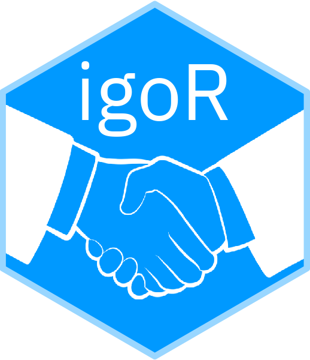

<!-- README.md is generated from README.Rmd. Please edit that file -->

# igoR 

<!-- badges: start -->

[](https://CRAN.R-project.org/package=igoR)
[](https://cran.r-project.org/web/checks/check_results_igoR.html)
[](https://cran.r-project.org/package=igoR)
[](https://dieghernan.r-universe.dev/)
[](https://github.com/dieghernan/igoR/actions)
[](https://codecov.io/gh/dieghernan/igoR)
[](https://www.codefactor.io/repository/github/dieghernan/igor)
[](https://doi.org/10.5281/zenodo.4442958)
[](https://lifecycle.r-lib.org/articles/stages.html#stable)
[](https://CRAN.R-project.org/package=igoR)

<!-- badges: end -->

The goal of `igoR` is to provide access and to extract information from
the Intergovernmental Organizations Database (IGOs), version 3, provided
by the Correlates of War Project <https://correlatesofwar.org/>
(Pevehouse et al. (2020)).

The dataset (V3) includes information of **534** IGO from 1816 to 2014,
as well as membership information.

**Source**: [Intergovernmental Organizations
(v3)](https://correlatesofwar.org/data-sets/IGOs).

Documentation and vignettes on <https://dieghernan.github.io/igoR/>

Additionally, a distribution of the State System Membership (Correlates
of War Project (2017)) is included on this package.

## Installation

Install `igoR` from [**CRAN**](https://CRAN.R-project.org/package=igoR):

``` r
install.packages("igoR")
```

You can install the developing version from GitHub:

``` r
library(remotes)
install_github("dieghernan/igoR")
```

Alternatively, you can install `igoR` using the
[r-universe](https://dieghernan.r-universe.dev/ui#builds):

``` r
# Enable this universe
options(repos = c(
  dieghernan = "https://dieghernan.r-universe.dev",
  CRAN = "https://cloud.r-project.org"
))


install.packages("igoR")
```

## Basic usage

### Search an IGO by name:

Search all IGOs related with sugar:

``` r
library(igoR)

result_sugar <- igo_search("Sugar")
```

| ionum | ioname  | orgname                                    | longorgname                                                     | label                                                           | sdate | deaddate | dead | integrated | replaced | igocode | version | accuracyofpre1965membershipdates                      | sourcesandnotes | imputed | political | social | economic |
| ----: | :------ | :----------------------------------------- | :-------------------------------------------------------------- | :-------------------------------------------------------------- | ----: | -------: | ---: | ---------: | -------: | ------: | ------: | :---------------------------------------------------- | :-------------- | ------: | --------: | -----: | -------: |
|    40 | AMSC    | African/Malgasy Sugar Council              | African and Malagasy Sugar Council                              | African and Malagasy Sugar Council                              |  1966 |     1977 |    1 |          0 |        0 |      NA |     2.1 | Not applicable - created 1965 or later                |                 |       0 |         0 |      0 |        1 |
|  1920 | GLACSEC | Group of L/A & Carib. Sugar Exp. Countries | Group of Latin American and Caribbean Sugar Exporting Countries | Group of Latin American and Caribbean Sugar Exporting Countries |  1974 |     2001 |    1 |          0 |        0 |      NA |     2.3 | Not applicable - created 1965 or later                |                 |       0 |         1 |      0 |        0 |
|  3130 | ISuC    | Intl Sugar Council                         | International Sugar Council                                     | International Sugar Council                                     |  1937 |     1967 |    1 |          0 |        0 |      91 |     3.0 | Within 5 years                                        |                 |       0 |         0 |      1 |        0 |
|  4290 | SugU    | Sugar Union                                | Sugar Union                                                     | Sugar Union                                                     |  1902 |     1913 |    1 |          0 |        0 |      29 |     3.0 | Completely accurate, except a few minor uncertainties |                 |       0 |         0 |      0 |        1 |

### IGO members:

Composition of the [European Economic
Community](https://en.wikipedia.org/wiki/European_Economic_Community)
over time:

``` r

eec_code <- igo_search("EEC", exact = TRUE)

# Founding
eec_init <- igo_members(eec_code$ioname, year = eec_code$sdate)
```

| ioname | ccode | state       | statenme                | year | value | category        | orgname                     |
| :----- | ----: | :---------- | :---------------------- | ---: | ----: | :-------------- | :-------------------------- |
| EEC    |   211 | belgium     | Belgium                 | 1958 |     1 | Full Membership | European Economic Community |
| EEC    |   220 | france      | France                  | 1958 |     1 | Full Membership | European Economic Community |
| EEC    |   325 | italy       | Italy                   | 1958 |     1 | Full Membership | European Economic Community |
| EEC    |   212 | luxembourg  | Luxembourg              | 1958 |     1 | Full Membership | European Economic Community |
| EEC    |   210 | netherlands | Netherlands             | 1958 |     1 | Full Membership | European Economic Community |
| EEC    |   260 | wgermany    | German Federal Republic | 1958 |     1 | Full Membership | European Economic Community |

EEC, members (1958)

``` r

# Latest date
eec_end <- igo_members(eec_code$ioname)
```

| ioname | ccode | state       | statenme       | year | value | category        | orgname                     |
| :----- | ----: | :---------- | :------------- | ---: | ----: | :-------------- | :-------------------------- |
| EEC    |   211 | belgium     | Belgium        | 1992 |     1 | Full Membership | European Economic Community |
| EEC    |   390 | denmark     | Denmark        | 1992 |     1 | Full Membership | European Economic Community |
| EEC    |   220 | france      | France         | 1992 |     1 | Full Membership | European Economic Community |
| EEC    |   255 | germany     | Germany        | 1992 |     1 | Full Membership | European Economic Community |
| EEC    |   350 | greece      | Greece         | 1992 |     1 | Full Membership | European Economic Community |
| EEC    |   205 | ireland     | Ireland        | 1992 |     1 | Full Membership | European Economic Community |
| EEC    |   325 | italy       | Italy          | 1992 |     1 | Full Membership | European Economic Community |
| EEC    |   212 | luxembourg  | Luxembourg     | 1992 |     1 | Full Membership | European Economic Community |
| EEC    |   210 | netherlands | Netherlands    | 1992 |     1 | Full Membership | European Economic Community |
| EEC    |   235 | portugal    | Portugal       | 1992 |     1 | Full Membership | European Economic Community |
| EEC    |   230 | spain       | Spain          | 1992 |     1 | Full Membership | European Economic Community |
| EEC    |   200 | uk          | United Kingdom | 1992 |     1 | Full Membership | European Economic Community |

EEC, members (1992)

## Recommended packages

  - `countrycode` for converting country names and codes across
    different systems (ISO3, Eurostat, World Bank, UN, FIPS/GEC, etc..)
  - `dplyr` for data manipulation.

## Citation

To cite the `igoR` package in publications use:

D. Hernangómez (2021). igoR: Intergovernmental Organizations Database. R
package version 0.1.2. <https://doi.org/10.5281/zenodo.4442958>.

You can also use:

``` r
print(citation("igoR"), bibtex = TRUE)
#> 
#> To cite the 'igoR' package in publications use this entry:
#> 
#>   Hernangómez, D (2021). igoR: Intergovernmental Organizations
#>   Database. R package version 0.1.2.
#>   http://doi.org/10.5281/zenodo.4442958
#> 
#> A BibTeX entry for LaTeX users is
#> 
#>   @Misc{,
#>     title = {igoR: Intergovernmental Organizations Database},
#>     author = {Diego Hernangómez},
#>     year = {2021},
#>     note = {R package version 0.1.2},
#>     url = {https://dieghernan.github.io/igoR/},
#>     doi = {10.5281/zenodo.4442958},
#>   }
#> 
#> Please cite also:
#> 
#>   Pevehouse JC, Nordstrom T, McManus RW, Jamison AS. Tracking
#>   organizations in the world: The Correlates of War IGO Version 3.0
#>   datasets. Journal of Peace Research. 2020;57(3):492-503.
#>   doi:10.1177/0022343319881175
#> 
#> A BibTeX entry for LaTeX users is
#> 
#>   @Article{,
#>     author = {Jon CW Pevehouse and Timothy Nordstrom and Roseanne W McManus and Anne Spencer Jamison},
#>     title = {Tracking organizations in the world: The Correlates of War IGO Version 3.0 datasets},
#>     journal = {Journal of Peace Research},
#>     volume = {57},
#>     number = {3},
#>     pages = {492-503},
#>     year = {2020},
#>     doi = {10.1177/0022343319881175},
#>     url = {https://doi.org/10.1177/0022343319881175},
#>     eprint = {https://doi.org/10.1177/0022343319881175},
#>     abstract = {This article summarizes the Correlates of War Intergovernmental Organizations (IGO) Version 3.0 datasets. The new datasets include information about the population of IGOs in the international system and state participation in those formal international institutions from 1816 to 2014. Consistent with Versions 2.0 and 2.3, Version 3.0 of the IGO data comes in three forms: country-year, IGO-year, and joint dyadic membership.},
#>   }
```

## References

<div id="refs" class="references">

<div id="ref-cow_2017">

Correlates of War Project. 2017. “State System Membership List, v2016.”
<https://correlatesofwar.org/>.

</div>

<div id="ref-doi:10.1177/0022343319881175">

Pevehouse, Jon CW, Timothy Nordstrom, Roseanne W McManus, and Anne
Spencer Jamison. 2020. “Tracking Organizations in the World: The
Correlates of War IGO Version 3.0 Datasets.” *Journal of Peace Research*
57 (3): 492–503. <https://doi.org/10.1177/0022343319881175>.

</div>

</div>
