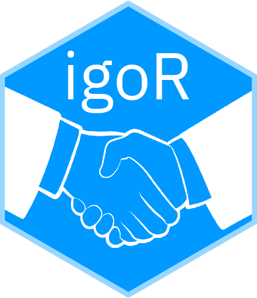

<!-- README.md is generated from README.qmd. Please edit that file -->

# igoR <a href='https://dieghernan.github.io/igoR/'></a>

<!-- badges: start -->

[](https://CRAN.R-project.org/package=igoR)
[](https://cran.r-project.org/web/checks/check_results_igoR.html)
[](https://cran.r-project.org/package=igoR)
[](https://dieghernan.r-universe.dev/)
[](https://github.com/dieghernan/igoR/actions/workflows/check-full.yaml)
[](https://app.codecov.io/gh/dieghernan/igoR)
[](https://coveralls.io/github/dieghernan/igoR)
[](https://www.codefactor.io/repository/github/dieghernan/igor)
[](https://doi.org/10.32614/CRAN.package.igoR)
[](https://lifecycle.r-lib.org/articles/stages.html#stable)
[](https://CRAN.R-project.org/package=igoR)

<!-- badges: end -->

**igoR** provides tools for searching, extracting and recoding the
Intergovernmental Organizations Database (version 3), distributed by the
Correlates of War Project [@pevehouse2020].

The IGO-year data set contains **`r nrow(igoR::igo_search())`** IGOs recorded
from `r min(igoR::igo_year_format3$year)` to
`r max(igoR::igo_year_format3$year)`. The package also includes country-year
membership data, state system data [@correlatesofwarproject2017] and functions
for deriving dyad-year joint membership results.

- Source: [Intergovernmental Organizations (version
  3)](https://correlatesofwar.org/data-sets/IGOs/).
- Documentation and vignettes at <https://dieghernan.github.io/igoR/>.

## Installation

::: pkgdown-release
Install **igoR** from [**CRAN**](https://CRAN.R-project.org/package=igoR):

```{r}
#| eval: false
install.packages("igoR")
```
:::

::: pkgdown-devel
Check the documentation for the development version at
<https://dieghernan.github.io/igoR/dev/>.

You can install the development version from GitHub:

```{r}
#| eval: false
pak::pak("dieghernan/igoR")
```

Alternatively, you can install **igoR** using
[r-universe](https://dieghernan.r-universe.dev/igoR):

```{r}
#| eval: false
# Install igoR from r-universe.
install.packages(
  "igoR",
  repos = c(
    "https://dieghernan.r-universe.dev",
    "https://cloud.r-project.org"
  )
)
```
:::

## Basic usage

### Search for IGOs by name

Search for IGOs related to "sugar".

```{r}
#| label: search
library(igoR)

result_sugar <- igo_search("Sugar")
```

```{r}
#| echo: false
#| output: asis
knitr::kable(result_sugar)
cat("<p class=\"caption\">Table 1: IGOs related to sugar</p>")
```

### IGO members

Extract the members of the [European Economic
Community](https://en.wikipedia.org/wiki/European_Economic_Community) over time.

```{r}
#| label: eec
eec_code <- igo_search("EEC", exact = TRUE)

# Get founding members.
eec_init <- igo_members(eec_code$ioname, year = eec_code$sdate)
```

```{r}
#| echo: false
#| output: asis
knitr::kable(eec_init)
cat(
  paste0(
    "<p class=\"caption\">Table 2: EEC members (",
    unique(eec_init$year),
    ")</p>"
  )
)
```

```{r}
#| label: eec_end
# Get members in the latest available year.
eec_end <- igo_members(eec_code$ioname)
```

```{r}
#| echo: false
#| output: asis
knitr::kable(eec_end)

cat(
  paste0(
    "<p class=\"caption\">Table 3: EEC members (",
    unique(eec_end$year),
    ")</p>"
  )
)
```

## Recommended packages

- **countrycode** package for converting country names and codes across systems,
  including ISO3, Eurostat, World Bank, UN and FIPS/GEC.
- **dplyr** package for data manipulation.

## Citation

```{r}
#| label: cit
#| echo: false
#| results: asis
print(citation("igoR")[1], style = "html")
```

For LaTeX users, a BibTeX entry is:

```{r}
#| echo: false
#| comment: ""
toBibtex(citation("igoR")[1])
```

## References
