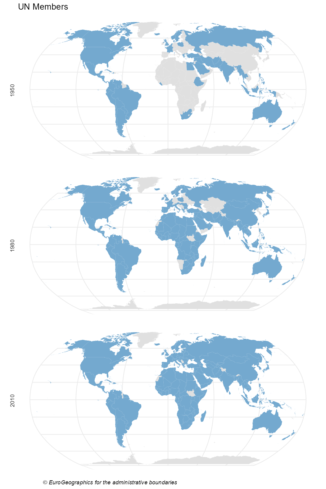
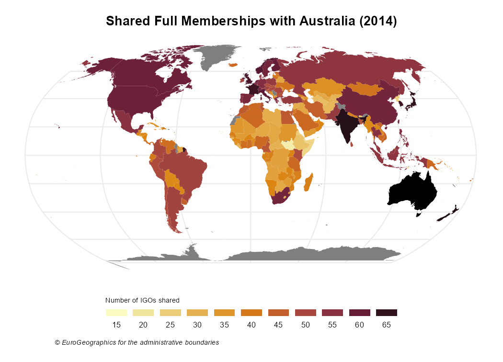

# Mapping IGOs

Maps are a powerful tool to show data. As the scope of **igoR** is the
Intergovernmental Organizations, mapping and IGOs are a perfect match.

This vignette provides some geospatial visualizations using the IGO data
sets ([Pevehouse et al. 2020](#ref-pevehouse2020)) included in this
package. Specific packages used for geospatial data:

- **giscoR** for extracting the shapefiles of the countries.
- **ggplot2** for plotting.

Also **countrycode** is a very handy package for translating between
coding schemes (CoW, ISO3, NUTS, FIPS) and country names.

``` r
library(igoR)

# Helper packages
library(dplyr)
library(ggplot2)
library(countrycode)

# Geospatial packages
library(giscoR)
library(sf)
```

## Evolution of the composition of UN

The following map shows the evolution of countries that are members of
the United Nations. First we should extract the data:

``` r
# Extract shapes
world <- gisco_get_countries()

# Extract three dates - some errors given that ISO doesn't have every COW Code
un_all <- igo_members("UN", c(1950, 1980, 2010), status = "Full Membership") %>%
  # Add ISO3 Code
  mutate(ISO3_CODE = countrycode(ccode, "cown", "iso3c", warn = FALSE)) %>%
  select(year, orgname, ISO3_CODE, category)

# Auxiliar data.frame to collect every ISO3-year pairs

base_df <- expand.grid(
  ISO3_CODE = unique(world$ISO3_CODE),
  year = unique(un_all$year),
  stringsAsFactors = FALSE
) %>%
  as_tibble()

# Merge everything with the spatial object
un_all_sf <- world %>%
  # Expand to all cases
  left_join(base_df, by = "ISO3_CODE") %>%
  # Add info
  left_join(un_all, by = c("ISO3_CODE", "year"))
```

Note that the map is not completely accurate, as the base shapefile
contains the countries that existed in 2016. Some countries, such as
Czechoslovakia, East Germany and West Germany are not included.

Now we are ready to plot with **ggplot2**:

``` r
ggplot(un_all_sf) +
  geom_sf(aes(fill = category), color = NA, show.legend = FALSE) +
  # Robinson
  coord_sf(crs = "ESRI:54030") +
  facet_wrap(~year, ncol = 1, strip.position = "left") +
  scale_fill_manual(
    values = c("Full Membership" = "#74A9CF"),
    na.value = "#E0E0E0",
  ) +
  labs(
    title = "UN Members", caption = gisco_attributions(),
  ) +
  theme_minimal() +
  theme(
    plot.caption = element_text(face = "italic", hjust = 0.15),
    axis.line = element_blank(),
    axis.text = element_blank()
  )
```



UN Members

## Number of shared memberships

Shared memberships are useful for identifying regional patterns. The
following code produces a map showing the number of full memberships
shared with Australia for each country in the world:

``` r
## Number of igos shared - 2014
# Countries alive in 2014
states2014 <- states2016 %>%
  filter(styear <= 2014 & endyear >= 2014)

# Shared memberships with Australia
shared <- igo_dyadic("AUL", as.character(states2014$statenme),
  year = 2014
) %>%
  rowwise() %>%
  mutate(shared = sum(c_across(aaaid:wassen) == 1)) %>%
  mutate(ISO3_CODE = countrycode(ccode2, "cown", "iso3c",
    warn = FALSE
  )) %>%
  select(ISO3_CODE, shared)


# Merge with map
sharedmap <- world %>%
  left_join(shared, by = "ISO3_CODE") %>%
  select(ISO3_CODE, shared)

# Plot with custom palette
pal <- hcl.colors(10, palette = "Lajolla")

# Plot
ggplot(sharedmap) +
  geom_sf(aes(fill = shared), color = NA) +
  # Australia
  geom_sf(
    data = sharedmap %>% filter(ISO3_CODE == "AUS"),
    fill = "black", color = NA,
  ) +
  # Robinson
  coord_sf(crs = "ESRI:54030") +
  scale_fill_gradientn(colours = pal, n.breaks = 10) +
  guides(fill = guide_legend(nrow = 1)) +
  labs(
    title = "Shared Full Memberships with Australia (2014)",
    fill = "Number of IGOs shared",
    caption = gisco_attributions()
  ) +
  theme_minimal() +
  theme(
    plot.title = element_text(face = "bold", hjust = 0.5),
    plot.caption = element_text(face = "italic", size = 7, hjust = 0.15),
    axis.line = element_blank(),
    axis.text = element_blank(),
    legend.title = element_text(size = 7),
    legend.text = element_text(size = 8),
    legend.position = "bottom",
    legend.direction = "horizontal",
    legend.title.position = "top",
    legend.text.position = "bottom",
    legend.key.width = unit(1.5, "lines"),
    legend.key.height = unit(0.5, "lines")
  )
```



Shared Full Memberships with Australia (2014)

## Cross-shared memberships

The following map shows how the relationships between the countries of
North America have flourished over the last 90 years, using a year as
representative of each decade.

``` r
# Select years
years <- seq(1930, 2010, 10)

# Shared memberships
cntries <- c("USA", "CAN", "MEX")
all <- igo_dyadic(cntries, cntries, years) %>%
  rowwise() %>%
  mutate(value = sum(c_across(aaaid:wassen) == 1)) %>%
  mutate(ISO3_CODE = countrycode(ccode1, "cown", "iso3c")) %>%
  select(ISO3_CODE, year, value)

# Create map
# Get shapes
countries_sf <- gisco_get_countries(country = c("USA", "MEX", "CAN")) %>%
  left_join(all, by = "ISO3_CODE")

# Map
ggplot(countries_sf) +
  geom_sf(aes(fill = value), color = NA) +
  coord_sf(crs = 9311, xlim = c(-3200000, 3333018)) +
  facet_wrap(~year, ncol = 3) +
  scale_fill_gradientn(
    colors = hcl.colors(10, "YlGn", rev = TRUE),
    breaks = seq(0, 100, 5)
  ) +
  guides(fill = guide_legend(reverse = TRUE)) +
  labs(
    title = "Shared Full Memberships on North America",
    subtitle = "(1930-2010)", fill = "Shared IGOs",
    caption = gisco_attributions()
  ) +
  theme_minimal() +
  theme(
    panel.grid = element_blank(),
    axis.line = element_blank(),
    axis.text = element_blank(),
    strip.background = element_rect(fill = "grey90", colour = NA)
  )
```


Shared Full Memberships on North America (1930 - 2010)

## References

Pevehouse, Jon CW, Timothy Nordstrom, Roseanne W McManus, and Anne
Spencer Jamison. 2020. “Tracking Organizations in the World: The
Correlates of War IGO Version 3.0 Datasets.” *Journal of Peace Research*
57 (3): 492–503. <https://doi.org/10.1177/0022343319881175>.
