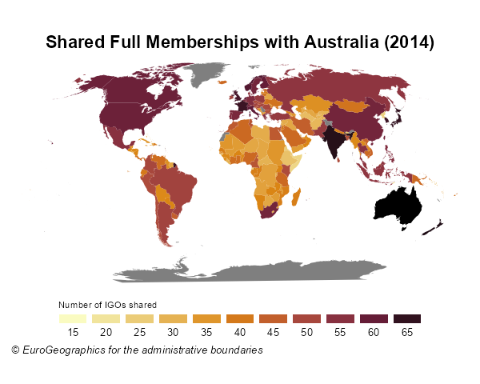
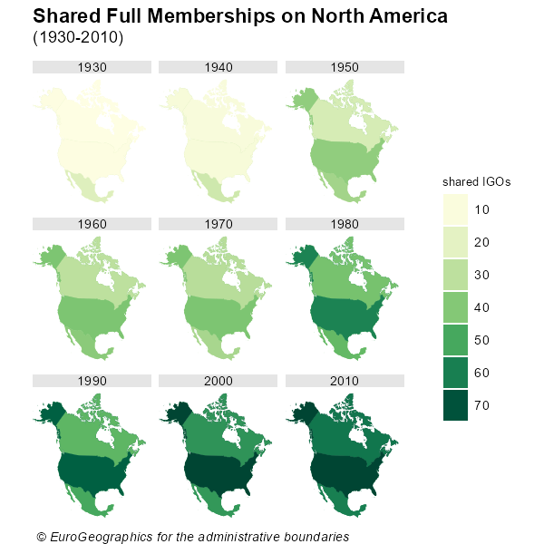

```{r knitr_config, include = FALSE}

start_time <- Sys.time()
knitr::opts_chunk$set(
  collapse = TRUE,
  comment = "#>",
  warning = FALSE,
  message = FALSE,
  out.width = "100%"
)
```

Maps are a powerful tool to show data. As the scope of `igoR` are the InterGovermental Organizations, mapping and IGOs are a perfect match.

This vignette provides some geospatial visualizations using the IGO datasets (@doi:10.1177/0022343319881175) included in this package. Specific packages
used for geospatial data:

* `giscoR` for extracting the shapefiles of the countries.
* `ggplot2` for plotting.

Also `countrycode` is a very handy package for translating between coding
schemes (CoW, ISO3, NUTS, FIPS) and country names.

```{r libs, eval=FALSE}

library(igoR)

# Helper packages
library(dplyr)
library(ggplot2)
library(countrycode)

# Geospatial packages
library(giscoR)
```


## Evolution of the composition of UN

The following maps shows the evolution of countries that are members of the
United Nations.


First we should extract the data:

```{r UN, eval=FALSE}
# Extract shapes

world <- gisco_get_countries(year = "2010")

un <- igo_search("UN", exact = TRUE)

# Extract three dates - some errors given that ISO doesnt have every COW Code
# Also join with world sf
UN1950 <-
  igo_members("UN", 1950) %>%
  mutate(ISO3_CODE = countrycode(ccode,
    "cown",
    "iso3c",
    warn = FALSE
  )) %>%
  left_join(world, .) %>%
  mutate(year = 1950) %>%
  select(year, orgname)

UN1980 <-
  igo_members("UN", 1980) %>%
  mutate(ISO3_CODE = countrycode(ccode,
    "cown",
    "iso3c",
    warn = FALSE
  )) %>%
  left_join(world, .) %>%
  mutate(year = 1980) %>%
  select(year, orgname)

UN2010 <-
  igo_members("UN", 2010) %>%
  mutate(ISO3_CODE = countrycode(ccode,
    "cown",
    "iso3c",
    warn = FALSE
  )) %>%
  left_join(world, .) %>%
  mutate(year = 2010) %>%
  select(year, orgname)

# Join all

UN_all <- bind_rows(UN1950, UN1980, UN2010)
```

Note that the map is not completely accurate, as the base shapefile contains 
the countries that exists on 2016. Some countries, as Czechoslovakia, East 
or West Germany are not included. 

Now we are ready to plot with `ggplot2`:


```{r UNMaps, eval=FALSE}

ggplot(UN_all) +
  geom_sf(aes(fill = orgname), color = NA, show.legend = FALSE) +
  # Robinson
  coord_sf(crs = "ESRI:54030") +
  facet_wrap(vars(year),
    ncol = 1,
    strip.position = "left"
  ) +
  scale_fill_manual(
    values = "#74A9CF",
    na.value = "#E0E0E0"
  ) +
  theme_void() +
  labs(
    title = "UN Members",
    caption = gisco_attributions()
  ) +
  theme(plot.caption = element_text(face = "italic"))
```

```{r echo=FALSE, out.width="100%"}

knitr::include_graphics("UNMaps.png")
```

## Number of shared memberships

Shared memberships are useful for identifying regional patterns.

The following code produces a map showing the number of full memberships
shared with Australia for each country on the world:

```{r AustShared, fig.asp=0.8, eval=FALSE}

## Number of igos shared - 2014

# Countries alive in 2014

states2014 <- states2016 %>%
  filter(styear <= 2014 & endyear >= 2014)


# Shared memberships with Australia

shared <- igo_dyadic("AUL",
  as.character(states2014$statenme),
  year = 2014
)
shared$shared <- rowSums(shared == 1)

# ISO3 Code
shared$ISO3_CODE <- countrycode(shared$ccode2,
  "cown",
  "iso3c",
  warn = FALSE
)


# Merge with map
sharedmap <-
  world %>%
  left_join(shared) %>%
  select(ISO3_CODE, shared)

# Plot with custom palette

pal <- hcl.colors(10, palette = "Lajolla")

# Plot

ggplot(sharedmap) +
  geom_sf(aes(fill = shared), color = NA) +
  # Australia
  geom_sf(
    data = sharedmap %>% filter(ISO3_CODE == "AUS"),
    fill = "black",
    color = NA,
  ) +
  # Robinson
  coord_sf(crs = "ESRI:54030") +
  scale_fill_gradientn(
    colours = pal,
    n.breaks = 10,
    guide = "legend"
  ) +
  guides(fill = guide_legend(
    direction = "horizontal",
    title.position = "top",
    label.position = "bottom",
    nrow = 1,
    keyheight = 0.5,
    keywidth = 1.5
  )) +
  labs(
    title = "Shared Full Memberships with Australia (2014)",
    fill = "Number of IGOs shared",
    caption = gisco_attributions()
  ) +
  theme_void() +
  theme(
    legend.position = "bottom",
    plot.title = element_text(face = "bold", hjust = 0.5),
    plot.caption = element_text(
      face = "italic",
      size = 8,
      hjust = 0.05
    ),
    legend.title = element_text(size = 7),
    legend.text = element_text(size = 8)
  )
```
```{r echo=FALSE, out.width="100%"}


```


## Cross-shared memberships

The following map shows how the relationships between the countries of
North America has flourished on the last 90 years, using a year as
representative of each decade.


```{r NAShared, eval=FALSE}

# Get shapes
countries.sf <- gisco_get_countries(country = c("USA", "MEX", "CAN"))

# Select years
years <- seq(1930, 2010, 10)

# Shared memberships
USA <- igo_dyadic("USA", c("MEX", "CAN"), years)
CAN <- igo_dyadic("CAN", c("USA", "MEX"), years)
MEX <- igo_dyadic("MEX", c("CAN", "USA"), years)

USA$value <- rowSums(USA == 1)
CAN$value <- rowSums(CAN == 1)
MEX$value <- rowSums(MEX == 1)

# Long data
Final <- USA %>%
  rbind(CAN) %>%
  rbind(MEX) %>%
  select(ccode1, year, value) %>%
  mutate(ISO3_CODE = countrycode(ccode1, "cown", "iso3c"))

# Create map
map <- left_join(countries.sf, Final)


# Map
ggplot(map) +
  geom_sf(aes(fill = value), color = NA) +
  coord_sf(
    crs = 2163,
    xlim = c(-3200000, 3333018)
  ) +
  facet_wrap(vars(year),
    ncol = 3
  ) +
  scale_fill_gradientn(
    colors = hcl.colors(10, "YlGn", rev = TRUE),
    breaks = seq(0, 100, 10),
    guide = "legend"
  ) +
  guides(fill = guide_legend(keyheight = 1.5)) +
  labs(
    title = "Shared Full Memberships on North America",
    subtitle = "(1930-2010)",
    fill = "shared IGOs",
    caption = gisco_attributions(),
  ) +
  theme_void() +
  theme(
    plot.title = element_text(face = "bold"),
    plot.subtitle = element_text(margin = margin(t = 3, b = 10)),
    plot.caption = element_text(
      face = "italic",
      hjust = 0.05
    ),
    legend.box.margin = margin(l = 20),
    legend.title = element_text(size = 8),
    strip.background = element_rect(fill = "grey90", colour = NA)
  )
```


```{r echo=FALSE, out.width="100%"}


```


## References
