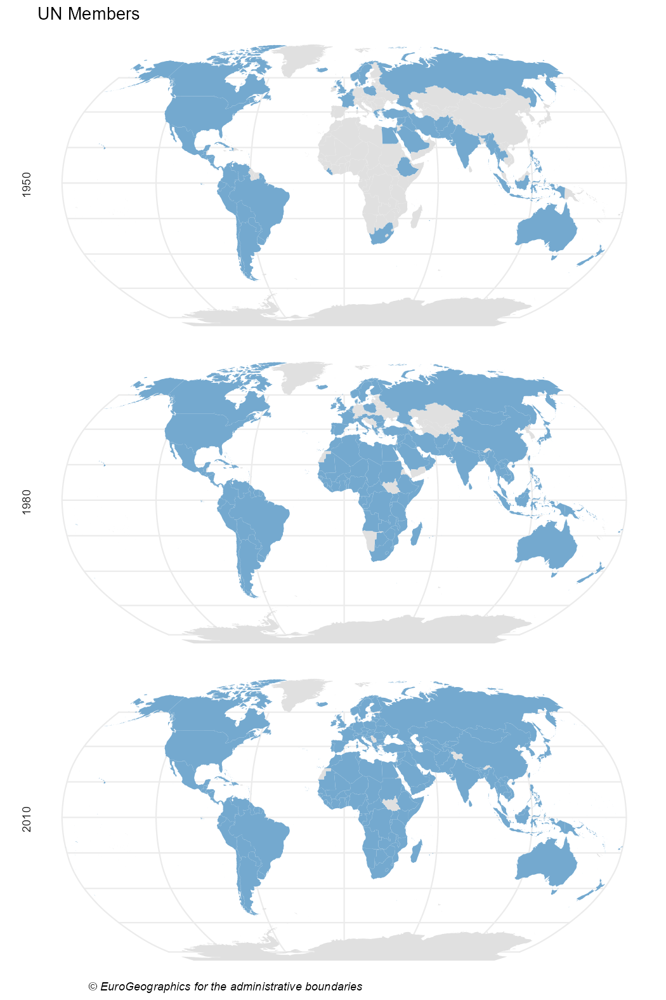
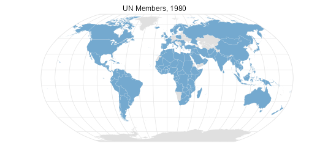
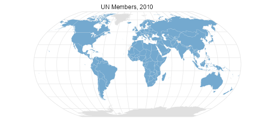
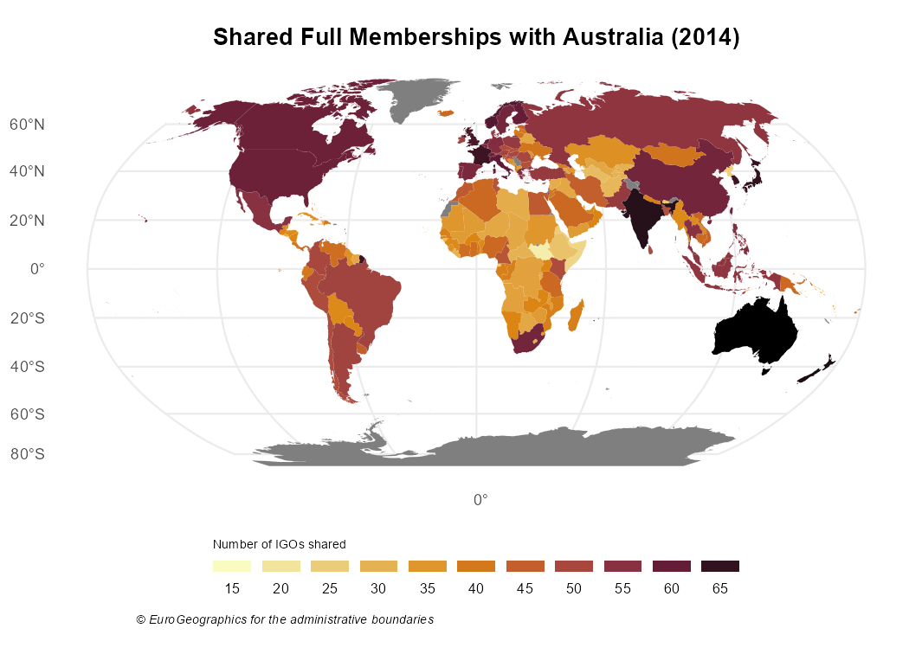
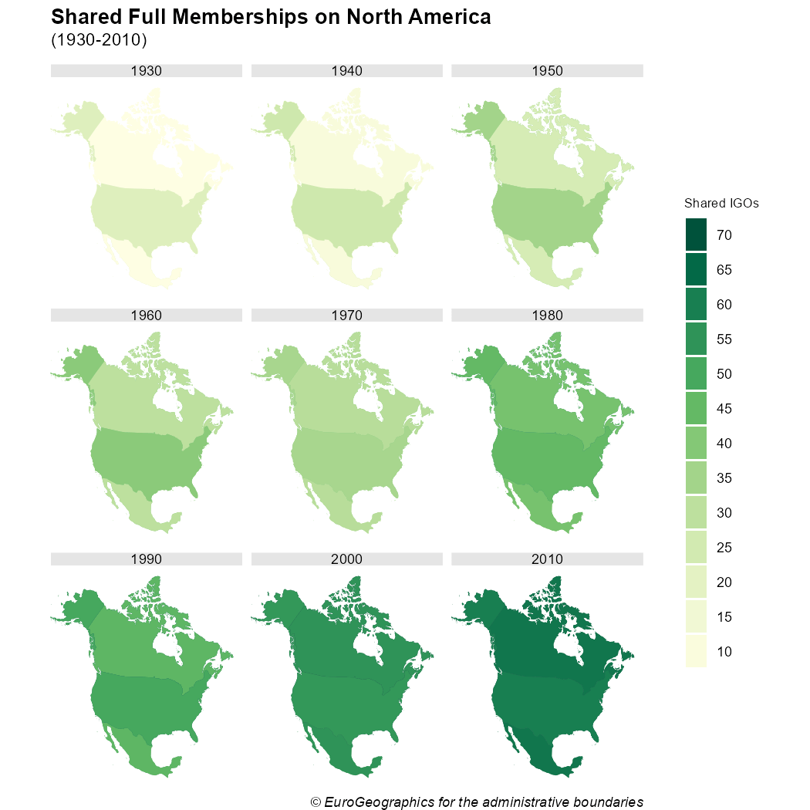

Maps are a powerful tool to show data. As the scope of `igoR` are the InterGovermental Organizations, mapping and IGOs are a perfect match.

This vignette provides some geospatial visualizations using the IGO datasets (@doi:10.1177/0022343319881175) included in this package. Specific packages used for geospatial data:

* `sf` for geospatial operations.
* `giscoR` for extracting the shapefiles of the countries.
* `tmap` for plotting.

Also `countrycode` is a very handy package for translating between coding schemes (CoW, ISO3, NUTS, FIPS) and country names.


```r

library(igoR)

# Helper packages
library(dplyr)
library(countrycode)

# Geospatial packages
library(sf)
library(giscoR)
library(tmap)
```


## Evolution of the composition of UN

The following maps shows the evolution of countries that are members of the United Nations.


First we should extract the data:


```r
# Extract shape and project to Robinson

# See https://epsg.io/54030
robin <-
  "+proj=robin +lon_0=0 +x_0=0 +y_0=0 +datum=WGS84 +units=m +no_defs"

world <-
  gisco_get_countries(year = "2010") %>%
  st_transform(robin)

un <- igo_search("UN", exact = TRUE)

# Extract three dates - some errors given that ISO doesnt have every COW Code
# Also join with world sf
UN1950 <-
  igo_members("UN", 1950) %>%
  mutate(ISO3_CODE = countrycode(ccode,
    "cown",
    "iso3c",
    warn = FALSE
  )) %>%
  inner_join(world, .)

UN1980 <-
  igo_members("UN", 1980) %>%
  mutate(ISO3_CODE = countrycode(ccode,
    "cown",
    "iso3c",
    warn = FALSE
  )) %>%
  inner_join(world, .)

UN2010 <-
  igo_members("UN", 2010) %>%
  mutate(ISO3_CODE = countrycode(ccode,
    "cown",
    "iso3c",
    warn = FALSE
  )) %>%
  inner_join(world, .)
```

Note that the map
is not completely accurate, as the base shapefile contains the countries
that exists on 2016 and some countries
(Czechoslovakia, East and West Germany) are not included. See [List of IGOs and Countries](https://dieghernan.github.io/igoR/articles/reference.html) for more information.

Now we are ready to plot with `tmap`:


```r


# UN 1950----


tm_shape(world) +
  tm_graticules(
    labels.show = FALSE,
    col = "grey90",
    x = seq(-180, 180, 20),
    y = seq(-90, 90, 20)
  ) +
  tm_layout(
    frame = FALSE,
    earth.boundary = TRUE,
    earth.boundary.color = "grey90",
    main.title = "UN Members, 1950",
    main.title.position = "center",
    main.title.size = 1
  ) +
  tm_polygons(
    col = "#E0E0E0",
    border.col = "white",
    lwd = 0.1
  ) +
  tm_shape(UN1950) +
  tm_polygons(
    col = "#74A9CF",
    border.col = "white",
    lwd = 0.1
  )


# UN 1980----


tm_shape(world) +
  tm_graticules(
    labels.show = FALSE,
    col = "grey90",
    x = seq(-180, 180, 20),
    y = seq(-90, 90, 20)
  ) +
  tm_layout(
    frame = FALSE,
    earth.boundary = TRUE,
    earth.boundary.color = "grey90",
    main.title = "UN Members, 1980",
    main.title.position = "center",
    main.title.size = 1
  ) +
  tm_polygons(
    col = "#E0E0E0",
    border.col = "white",
    lwd = 0.1
  ) +
  tm_shape(UN1980) +
  tm_polygons(
    col = "#74A9CF",
    border.col = "white",
    lwd = 0.1
  )

# UN 2010----
tm_shape(world) +
  tm_graticules(
    labels.show = FALSE,
    col = "grey90",
    x = seq(-180, 180, 20),
    y = seq(-90, 90, 20)
  ) +
  tm_layout(
    frame = FALSE,
    earth.boundary = TRUE,
    earth.boundary.color = "grey90",
    main.title = "UN Members, 2010",
    main.title.position = "center",
    main.title.size = 1
  ) +
  tm_polygons(
    col = "#E0E0E0",
    border.col = "white",
    lwd = 0.1
  ) +
  tm_shape(UN2010) +
  tm_polygons(
    col = "#74A9CF",
    border.col = "white",
    lwd = 0.1
  )
```




## Number of shared memberships

Shared memberships are useful for identifying regional patterns.

The following code produces a map showing the number of full memberships shared with Australia for each country on the world:


```r

## Number of igos shared - 2014

# Countries alive in 2014

states2014 <- states2016 %>%
  filter(styear <= 2014 & endyear >= 2014)


# Shared memberships with Australia

shared <-
  igo_dyadic("AUL", as.character(states2014$statenme), year = 2014)
shared$shared <- rowSums(shared == 1)

# ISO3 Code
shared$ISO3_CODE <- countrycode(shared$ccode2,
  "cown",
  "iso3c",
  warn = FALSE
)


# Merge with map
sharedmap <-
  world %>%
  left_join(shared) %>%
  select(ISO3_CODE, shared)

# Plot with custom palette

pal <- hcl.colors(5, palette = "Blues", rev = TRUE)

tm_shape(sharedmap) +
  tm_graticules(
    labels.show = FALSE,
    col = "grey90",
    x = seq(-180, 180, 20),
    y = seq(-90, 90, 20)
  ) +
  tm_layout(
    frame = FALSE,
    earth.boundary = TRUE,
    earth.boundary.color = "grey90",
    main.title = "Shared Full Memberships with Australia (2014)",
    main.title.position = "center",
    main.title.size = 1,
    legend.title.size = 0.8
  ) +
  tm_polygons(
    col = "shared",
    title = "number of IGOs",
    palette = pal,
    border.col = "white",
    lwd = 0.1
  ) +
  tm_shape(subset(sharedmap, ISO3_CODE == "AUS")) +
  tm_polygons(
    col = "black",
    border.col = "white",
    lwd = 0.1
  )
```



## Cross-shared memberships

The following map shows how the relationships between the countries of  North America has flourished on the last 90 years, using a year as representative of each decade.


```r

# Get shapes
countries.sf <-
  gisco_get_countries(country = c("USA", "MEX", "CAN")) %>%
  st_transform(2163)

# Select years
years <- seq(1930, 2010, 10)

# Shared memberships
USA <- igo_dyadic("USA", c("MEX", "CAN"), years)
CAN <- igo_dyadic("CAN", c("USA", "MEX"), years)
MEX <- igo_dyadic("MEX", c("CAN", "USA"), years)

USA$value <- rowSums(USA == 1)
CAN$value <- rowSums(CAN == 1)
MEX$value <- rowSums(MEX == 1)

# Long data
Final <- USA %>%
  rbind(CAN) %>%
  rbind(MEX) %>%
  select(ccode1, year, value) %>%
  mutate(ISO3_CODE = countrycode(ccode1, "cown", "iso3c"))

# Create map
map <- left_join(countries.sf, Final)

# Limits to exclude offshore
bbox <- st_bbox(countries.sf %>% filter(ISO3_CODE != "USA"))

# Map
tm_shape(map, bbox = bbox) +
  tm_fill(
    col = "value",
    title = "number of IGOs",
    palette = "YlGn"
  ) +
  tm_layout(
    main.title = "Shared Full Memberships on North America (1930-2010)",
    main.title.position = "center",
    main.title.size = 1,
    legend.title.size = 0.8
  ) +
  tm_facets(by = "year", nrow = 3)
```



## Session Info

<details>
  <summary><strong>Details</strong></summary>

```
#> R version 4.1.0 (2021-05-18)
#> Platform: x86_64-w64-mingw32/x64 (64-bit)
#> Running under: Windows Server x64 (build 17763)
#> 
#> Matrix products: default
#> 
#> locale:
#> [1] LC_COLLATE=English_United States.1252 
#> [2] LC_CTYPE=English_United States.1252   
#> [3] LC_MONETARY=English_United States.1252
#> [4] LC_NUMERIC=C                          
#> [5] LC_TIME=English_United States.1252    
#> 
#> attached base packages:
#> [1] stats     graphics  grDevices utils     datasets  methods   base     
#> 
#> other attached packages:
#> [1] tmap_3.3-2        giscoR_0.2.4      sf_1.0-2          countrycode_1.3.0
#> [5] dplyr_1.0.7       igoR_0.1.1.9010  
#> 
#> loaded via a namespace (and not attached):
#>  [1] fs_1.5.0           usethis_2.0.1      devtools_2.4.2     RColorBrewer_1.1-2
#>  [5] rprojroot_2.0.2    R.cache_0.15.0     tools_4.1.0        backports_1.2.1   
#>  [9] utf8_1.2.2         R6_2.5.0           KernSmooth_2.23-20 DBI_1.1.1         
#> [13] raster_3.4-13      urlchecker_1.0.0   withr_2.4.2        sp_1.4-5          
#> [17] tidyselect_1.1.1   prettyunits_1.1.1  processx_3.5.2     leaflet_2.0.4.1   
#> [21] curl_4.3.2         compiler_4.1.0     leafem_0.1.6       textshaping_0.3.5 
#> [25] cli_3.0.1          geojsonsf_2.0.1    xml2_1.3.2         desc_1.3.0        
#> [29] classInt_0.4-3     callr_3.7.0        proxy_0.4-26       commonmark_1.7    
#> [33] systemfonts_1.0.2  stringr_1.4.0      digest_0.6.27      R.utils_2.10.1    
#> [37] base64enc_0.1-3    dichromat_2.0-0    pkgconfig_2.0.3    htmltools_0.5.1.1 
#> [41] sessioninfo_1.1.1  styler_1.5.1       pkgdev_0.0.1.9002  fastmap_1.1.0     
#> [45] highr_0.9          htmlwidgets_1.5.3  rlang_0.4.11       rstudioapi_0.13   
#> [49] generics_0.1.0     crosstalk_1.1.1    R.oo_1.24.0        magrittr_2.0.1    
#> [53] s2_1.0.6           Rcpp_1.0.7         fansi_0.5.0        abind_1.4-5       
#> [57] lifecycle_1.0.0    R.methodsS3_1.8.1  stringi_1.7.3      leafsync_0.1.0    
#> [61] tmaptools_3.1-1    pkgbuild_1.2.0     grid_4.1.0         parallel_4.1.0    
#> [65] crayon_1.4.1       lattice_0.20-44    stars_0.5-3        knitr_1.33        
#> [69] ps_1.6.0           pillar_1.6.2       codetools_0.2-18   pkgload_1.2.1     
#> [73] wk_0.5.0           XML_3.99-0.6       glue_1.4.2         evaluate_0.14     
#> [77] remotes_2.4.0      vctrs_0.3.8        png_0.1-7          testthat_3.0.4    
#> [81] purrr_0.3.4        rematch2_2.1.2     cachem_1.0.5       xfun_0.24         
#> [85] lwgeom_0.2-7       e1071_1.7-8        roxygen2_7.1.1     ragg_1.1.3        
#> [89] class_7.3-19       viridisLite_0.4.0  tibble_3.1.3       memoise_2.0.0     
#> [93] units_0.7-2        ellipsis_0.3.2
#> ***
#> vignette running time:
#> Time difference of 8.644248 mins
```
</details>


## References
